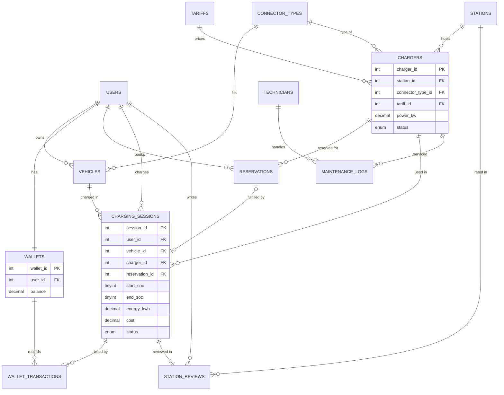

# E-R Diagram – EV Charging Station Network

Image versions: `03_er_diagram.png` and `03_er_diagram.svg`.
The Mermaid version below renders on GitHub and in VS Code.

```mermaid
erDiagram
    USERS ||--o{ VEHICLES : owns
    USERS ||--|| WALLETS : has
    USERS ||--o{ RESERVATIONS : books
    USERS ||--o{ CHARGING_SESSIONS : charges
    USERS ||--o{ STATION_REVIEWS : writes
    CONNECTOR_TYPES ||--o{ VEHICLES : fits
    CONNECTOR_TYPES ||--o{ CHARGERS : "type of"
    TARIFFS ||--o{ CHARGERS : prices
    STATIONS ||--o{ CHARGERS : hosts
    STATIONS ||--o{ STATION_REVIEWS : "rated in"
    CHARGERS ||--o{ RESERVATIONS : "reserved for"
    CHARGERS ||--o{ CHARGING_SESSIONS : "used in"
    CHARGERS ||--o{ MAINTENANCE_LOGS : serviced
    TECHNICIANS ||--o{ MAINTENANCE_LOGS : handles
    VEHICLES ||--o{ CHARGING_SESSIONS : "charged in"
    RESERVATIONS |o--o| CHARGING_SESSIONS : "fulfilled by"
    WALLETS ||--o{ WALLET_TRANSACTIONS : records
    CHARGING_SESSIONS ||--o{ WALLET_TRANSACTIONS : "billed by"
    CHARGING_SESSIONS ||--o| STATION_REVIEWS : "reviewed in"

    CHARGERS { int charger_id PK
        int station_id FK
        int connector_type_id FK
        int tariff_id FK
        decimal power_kw
        enum status }
    CHARGING_SESSIONS { int session_id PK
        int user_id FK
        int vehicle_id FK
        int charger_id FK
        int reservation_id FK
        tinyint start_soc
        tinyint end_soc
        decimal energy_kwh
        decimal cost
        enum status }
    WALLETS { int wallet_id PK
        int user_id FK
        decimal balance }
```
